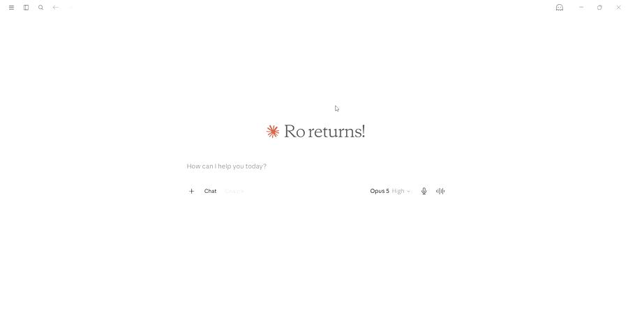

# rain-commute-mcp

[](https://github.com/rohithrag94-stack/rain-commute-mcp/actions/workflows/ci.yml)

An [MCP](https://modelcontextprotocol.io) server that checks whether rain is expected around the time you'd arrive at a destination, given how long your commute takes. Ask your MCP client "will it rain by the time I get to Bengaluru" and it looks up the forecast for the hour you'll actually land in — not just "right now."



## How it works

The server exposes a single MCP tool, `checkRainOnCommute`, backed by the free [Open-Meteo](https://open-meteo.com/) forecast and geocoding APIs:

1. Takes a destination as a plain place name or address (e.g. `"Bengaluru"`, `"Eiffel Tower, Paris"`, or a saved shortcut like `"home"` — see [Personalizing it](#personalizing-it)) and a commute duration in minutes (optional — falls back to a configurable default) — no coordinates required.
2. Geocodes the destination to coordinates. If the name matches more than one real place (e.g. "Springfield"), the answer still comes back for the best match, with a note about the others in case that wasn't the one you meant — see [How disambiguation works](#how-disambiguation-works).
3. Computes your arrival time (now + commute duration, rounded up to the next hour — see [How rounding works](#how-rounding-works)) **in the destination's own local timezone**, from its forecast response — not the server's timezone, so results are correct no matter where the user or the server process happens to be.
4. Fetches the hourly forecast for that location and reads off precipitation probability and rain amount for the arrival hour.
5. Returns a plain-language verdict — dry, or grab an umbrella.

### How disambiguation works

Some place names match more than one real location — "Springfield" alone matches at least five distinct US cities. Rather than silently picking one and possibly answering for the wrong place with no indication anything was ambiguous, the tool checks up to 5 candidates and mentions any others whose population is at least 20% of the top match's (e.g. asking about "Springfield" gets an answer for Springfield, Missouri, plus a note that Massachusetts and Illinois also matched). A name with one dominant match (e.g. "Paris" — Paris, France vs. Paris, Texas at roughly 1% of its population) gets a clean answer with no extra noise. See `GeocodingClient` in [AGENTS.md](AGENTS.md) for exactly how the threshold was picked.

### How rounding works

Open-Meteo's `precipitation_probability` and `rain` are **preceding-hour** values — the bucket labelled `20:00` covers rain that fell between 19:00 and 20:00, not 20:00 and 21:00. So an arrival at, say, 20:44 doesn't look up the `20:00` bucket; it rounds up to `21:00`, since that's the bucket whose preceding-hour window (20:00–21:00) is the one that actually contains 20:44. An arrival landing exactly on the hour (e.g. 21:00:00) is the one case that *doesn't* round up — it's already the top of its own window.

## Personalizing it

By default, "how long is your commute" has to be answered every time and every destination needs a real name. Both are optional to state explicitly: create a file at `~/.rain-commute-mcp/config.properties` (Windows: `%USERPROFILE%\.rain-commute-mcp\config.properties`) with whichever of these you want —

```properties
rain-commute.default-commute-minutes=25
rain-commute.locations.home=Bengaluru
rain-commute.locations.work=Electronic City
```

— and you can just ask "will it rain when I get home" without saying how long the commute is. This file is read in addition to the server's own defaults (not instead of them): anything you don't set keeps its built-in value, and it's picked up automatically on every start, no rebuild needed. If you don't create the file at all, everything works exactly as before (30-minute default commute, no shortcuts).

One thing worth knowing when choosing values for `rain-commute.locations.*`: Open-Meteo's geocoder is inconsistent about "specific place, containing city" queries — `Electronic City` resolves fine on its own, but `Electronic City, Bengaluru` doesn't, even though `Eiffel Tower, Paris` does. If a configured location comes back "couldn't find a place," try the bare name first.

## Prerequisites

- Java 25 ([Eclipse Temurin](https://adoptium.net/) or any JDK 25 distribution)
- Maven 3.9+
- An MCP-compatible client (e.g. [MCP Inspector](https://github.com/modelcontextprotocol/inspector), Claude Desktop)

## Build

Don't want to build it yourself? Grab the prebuilt jar from [Releases](https://github.com/rohithrag94-stack/rain-commute-mcp/releases) instead — same thing `mvn clean install` below produces, built and tested by CI, no Maven required.

```bash
mvn clean install
```

This produces an executable jar at `target/rain-commute-mcp-0.1.0.jar` and runs the full test suite with a coverage check (see [Testing](#testing) below).

## Running

The server communicates over stdio (standard MCP transport for local tools), so it's meant to be launched by an MCP client rather than run standalone. To try it directly:

```bash
java -jar target/rain-commute-mcp-0.1.0.jar
```

It will sit waiting for JSON-RPC messages on stdin — that's expected. Use MCP Inspector or a real client to talk to it (see below).

### Testing with MCP Inspector

```bash
npx @modelcontextprotocol/inspector java -jar target/rain-commute-mcp-0.1.0.jar
```

This opens a local web UI where you can call `checkRainOnCommute` directly and inspect the raw request/response.

### Wiring into Claude Desktop

Add an entry to your `claude_desktop_config.json`:

```json
{
  "mcpServers": {
    "rain-commute": {
      "command": "java",
      "args": ["-jar", "/absolute/path/to/rain-commute-mcp-0.1.0.jar"]
    }
  }
}
```

Restart Claude Desktop and the `checkRainOnCommute` tool becomes available in conversation.

## Configuration

| Property | Default | Description |
|---|---|---|
| `rain-commute.weather-api.base-url` | `https://api.open-meteo.com` | Base URL of the weather forecast API. Override to point at a mock/staging endpoint. |
| `rain-commute.geocoding-api.base-url` | `https://geocoding-api.open-meteo.com` | Base URL of the place-name geocoding API. Override to point at a mock/staging endpoint. |
| `rain-commute.default-commute-minutes` | `30` | Commute duration used when a request omits `commuteMinutes`. |
| `rain-commute.locations.<name>` | *(none)* | A location shortcut, e.g. `rain-commute.locations.home=Bengaluru` — see [Personalizing it](#personalizing-it). Any number of these can be set. |
| `spring.ai.mcp.server.name` | `rain-commute-mcp` | MCP server name advertised to clients. |
| `spring.ai.mcp.server.version` | `0.1.0` | MCP server version advertised to clients. |

Set any of these via `src/main/resources/application.properties` (rebuild required), environment variables (e.g. `RAIN_COMMUTE_WEATHER_API_BASE_URL`), `-D` system properties, or — for the two personalization properties specifically — the external file described in [Personalizing it](#personalizing-it), which needs no rebuild.

## Testing

```bash
mvn clean verify
```

Runs the unit test suite and enforces 100% line and method coverage via JaCoCo (`mvn jacoco:report` output lands in `target/site/jacoco/index.html`). Branch coverage is checked against a pinned baseline rather than a ratio — see the comment on the `jacoco-maven-plugin` config in [pom.xml](pom.xml) for why (short version: `javac`'s synthetic `MatchException` handling around pattern-matching `switch` isn't reachable from real tests; [jacoco/jacoco#1514](https://github.com/jacoco/jacoco/issues/1514)).

## Project structure

```
src/main/java/com/rocommute/mcp/
├── RainCommuteMcpApplication.java   # Boot entry point (excluded from coverage — no testable logic)
├── WeatherClientConfig.java         # WebClient (weather + geocoding) + Clock beans
├── RainCommuteProperties.java       # Location shortcuts + default commute minutes (user-configurable)
├── GeocodingClient.java             # Resolves a place name/address to coordinates, with disambiguation
└── CommuteWeatherService.java       # The @McpTool and its forecast logic
```

See [AGENTS.md](AGENTS.md) for a deeper architectural overview, the stack's version-specific gotchas, and conventions for anyone (human or agent) picking this repo up cold.

## Tech stack

- Java 25
- Spring Boot 4.0.7 / Spring Framework 7
- Spring AI 2.0.0 (MCP Server Boot Starter, stdio transport)
- Jackson 3 (`tools.jackson.*` — not classic `com.fasterxml.jackson.*`)
- JUnit 5 + AssertJ + JaCoCo 0.8.14

## License

MIT — see [LICENSE](LICENSE). Third-party dependency licenses (all permissive: Apache-2.0, MIT, EPL-2.0) are listed in [THIRD-PARTY-NOTICES.md](THIRD-PARTY-NOTICES.md).
